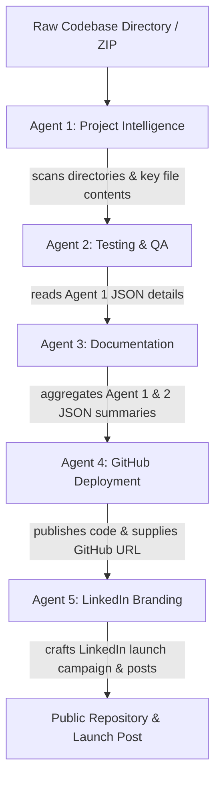

# Project Documentation: DevBuddy AI (ProjectPilot)
**Author:** Principal Software Architect & Lead Technical Writer  
**Target Audience:** Engineering Team, Product Managers, and Executive Presenters  
**Version:** 1.0.0 (Production Grade)  

---

## 1. Executive Summary & System Overview

### Core Value Proposition
DevBuddy AI is an AI-powered project packaging workspace designed to automate the process of turning a raw local codebase folder into a production-ready, launchable repository. It eliminates the manual work of writing documentation, structuring `.gitignore` configurations, performing quality audits, setting up repositories, and writing social marketing copy. By running five specialized AI agents in sequence, DevBuddy AI evaluates codebase health, creates dynamic PDF project reports, deploys code to GitHub, and crafts a professional branding campaign.

### Target Audience & Use-Cases
*   **Hackathon Participants & Indie Hackers:** Instantly package a weekend project with professional assets (README, LICENSE, gitignore, and docs) and post a launch announcement to LinkedIn.
*   **Junior Developers & Students:** Audit codebases to verify health, production-readiness, and security before publishing portfolios.
*   **Open Source Maintainers:** Standardize repository packaging and draft high-quality release summaries.

### Reconciling Brand Identity
The application's external product name is **DevBuddy AI** (as reflected in the brand title, dashboard, and public UI). Internally, the codebase classes, modules, stream messages, and internal comments refer to the core engine as **ProjectPilot AI**. The Python server and JavaScript controller seamlessly bridge this terminology by translating internal Pydantic schemas and pipeline logs into DevBuddy UI widgets and styling tokens.

### Multi-Agent Pipeline Context Handoff
Every step of the five-agent sequence builds on context compiled in prior stages. The orchestration engine propagates this information to prevent duplicate LLM processing and ensure a single cohesive analysis.



1.  **Project Selector:** Validates absolute path or extracts uploaded ZIP archive safely.
2.  **Agent 1 (Intelligence):** Reads directory tree structure and parses content of configuration and entry-point files. Yields a structured architectural JSON payload.
3.  **Agent 2 (QA):** Inspects the JSON payload from Agent 1 (e.g. dependencies, stack info) without re-scanning code files. Performs a rapid quality audit and outputs readiness scores.
4.  **Agent 3 (Docs):** Merges structural data from Agent 1 and QA findings from Agent 2, compiling a professional markdown review and rendering a download-ready PDF report.
5.  **Agent 4 (GitHub):** Reviews the previous outputs, suggests README/gitignore revisions, initializes Git locally, creates the repository, commits code, and pushes.
6.  **Agent 5 (LinkedIn):** Uses the compiled project summaries and the newly generated GitHub repository URL to compose editable launch descriptions and posts them directly to LinkedIn.

---

## 2. System Architecture & Tech Stack

```
├─ backend/            # Python backend application
│  ├─ backend.py       # Flask API, session management, and static file server
│  ├─ agents.py        # Class definitions for the 5 AI agents & Pydantic schemas
│  ├─ engine.py        # Sequential orchestration engine for executing agents
│  ├─ gemini_config.py # Centralized Gemini Client wrapper & model fallback order
│  └─ utils.py         # File system utilities (Zip extraction, directory tree generation)
├─ frontend/           # SPA Client Files
│  ├─ index.html       # DOM structure and layout panels
│  ├─ script.js        # Global state, fetch handlers, and SSE streaming
│  └─ styles.css       # Layout styles and breakpoints
├─ docker-compose.yml  # Optional Docker orchestration for backend and frontend
```

### Frontend Architecture
The frontend is constructed as a modern, lightweight Single Page Application (SPA).
*   **Structure:** Standard semantic HTML5 (`index.html`) using a grid container separating the fixed navigation sidebar (`aside.sidebar`) from the main display viewport (`main`).
*   **Navigation & Views:** Controlled entirely client-side. The JS controller listens for navigation actions and page selections, toggling the `.active` class on targeted section tags and `.hidden` on others to simulate page routing without reloading the browser.
*   **External Libraries:**
    *   `marked.js` (v15.0.12): Compiles markdown reports returned by the agents into standard HTML markup. It is configured with `gfm: true` (GitHub Flavored Markdown) and `breaks: true` (retains single-line breaks).
    *   `DOMPurify` (v3.2.6): Sanitizes HTML generated by marked.js on the client-side to prevent cross-site scripting (XSS) injections from unverified project names or file content.

### Backend Architecture
The backend is a Python web server using the Flask framework.
*   **Static Assets:** Hosts files inside the `/frontend` directory directly, resolving root requests to `index.html`.
*   **Session Management:** Web session profiles are tracked using standard HTTP cookies. Flask generates a UUID (`uuid.uuid4().hex`) session key mapped to an internal memory dictionary `_sessions`. The client stores this session ID in `localStorage` under `devbuddy_session` and transmits it via the `X-Session-ID` request header, enabling state preservation across page reloads.
*   **API Protocol:** Standard RESTful endpoints utilizing JSON exchange format.
*   **SSE Pipeline Stream:** The endpoint `/api/pipeline` initiates the agent run sequence. Rather than polling, the frontend establishes a real-time event listener. The Flask response streams Server-Sent Events (SSE) using a generator yielding Newline-Delimited JSON (NDJSON) events like `pipeline_start`, `agent_start`, `agent_log`, `agent_success`, `agent_failed`, and `pipeline_done`.
*   **Static File Serving:** Serves `/index.html`, `/styles.css`, and `/script.js` directly from the `frontend` folder.

### Client-Side State Management
The frontend manages state globally via a single mutable JavaScript object:
```javascript
const state = {
  session: localStorage.getItem('devbuddy_session') || '', // Active connection session UUID
  agents: [],          // Basic registry profiles (name, description, color, icon)
  project: null,        // Selected project path, file summary details, and tree representation
  results: null,        // Full results payload containing outcomes of each agent
  githubUrl: null,      // Live URL of the repository after successful deployment
  activeResult: 0,      // Index representing the currently active results tab
  diagnostics: null     // OAuth and permission details returned from LinkedIn validation
};
```

---

## 3. UI/UX Design System & Layout Mechanics

### Theme & Color Palette
DevBuddy AI uses a clean, premium design with a nature-inspired dark-green theme.

| Variable Name | Hex Code | System Usage |
| :--- | :--- | :--- |
| `--ink` | `#18221d` | Core text color, dark headers, visual components |
| `--muted` | `#69756e` | Secondary descriptive text, low-contrast UI hints |
| `--paper` | `#f5f7f3` | Global body canvas background color |
| `--card` | `#ffffff` | Background for panels, active lists, and input boxes |
| `--line` | `#dfe5df` | Standard thin borders and dividers |
| `--green` | `#246b4b` | Primary branding color, action buttons, active navigation states |
| `--green2` | `#3e8d68` | Secondary visual accents (blockquote borders, active hover states) |
| `--lime` | `#d9ed8a` | Accent color for callout badges and primary visual widgets |
| `--purple` | `#745de7` | Icon highlight for Gemini API and security keys |
| `--red` | `#d55f55` | Critical error banners and failed agent indicators |
| `--blue` | `#467ec9` | Information prompts, LinkedIn branding theme accents |

*   **Typography:** Set globally to "Inter" with fallbacks to system sans-serif font families. Smooth font smoothing is enabled (`-webkit-font-smoothing: antialiased`).

### Layout Breakpoints
The layout uses a mobile-first responsive layout structure to scale the screen layout across desktop, tablet, and mobile views.

1.  **Desktop View (>1100px):**
    *   Two-column source panel grid (`workspace-grid`) mapping path selection alongside project statistics.
    *   Horizontal five-column dashboard agent grid displaying active cards side-by-side.
2.  **Tablet View (780px to 1100px):**
    *   The agent grid collapses to 3 columns.
    *   The setting form columns reduce from 3 to 2 columns.
    *   The project dashboard hero section drops the decorative right-hand interactive orbital widget and centers the core call to action.
3.  **Mobile View (<780px):**
    *   The primary sidebar is hidden off-screen (`transform: translateX(-100%)`). Toggling the menu button adds the `.open` class, sliding the sidebar in from the left.
    *   Content margins slide back to `margin-left: 0`.
    *   Workspace panels, dashboard elements, settings cards, and lists stack into a single column.
    *   The header metadata "Step Chip" indicator is hidden (`display: none`).
4.  **Small Mobile View (<470px):**
    *   Metric displays, button groupings, and source verification forms stack vertically.

### Sidebar Collapse Feature ("Mini-Mode")
For desktop screens, the system provides a sidebar collapse feature to save space.

*   **HTML Structure:** The navigation menu button resides in the topbar header (`button#menuBtn`), listening for click events.
*   **JS Interaction:** When clicked on desktop screens (>780px), the controller toggles `.collapsed` on the sidebar `#sidebar` and `.expanded` on the `main` layout.
*   **CSS Transition and Width Adjustments:**
    *   The sidebar width transitions from `244px` to `78px` with a smooth ease curve (`transition: width 0.3s ease`).
    *   Text elements are hidden using `display: none` (`.sidebar.collapsed .brand span:not(.brand-mark)`, `.sidebar-foot`, `.connection-card`).
    *   Navigation item labels are hidden by setting `font-size: 0` on `.nav-item`.
    *   Navigation icons are centered and resized to `22px` for high visibility (`.sidebar.collapsed .nav-item span`).
    *   The main content offset transitions to prevent overlaps:
        ```css
        main { transition: margin-left 0.3s ease; }
        main.expanded { margin-left: 78px; }
        ```

---

## 4. Deep-Dive: The 5 Specialist AI Agents

### Agent 1: Project Intelligence Agent
*   **Purpose:** Performs directory tree scanning and reads key files to identify the software stack and primary architecture patterns.
*   **Frontend UI Component:** Renders the verified project summary, directory tree accordion, primary configuration labels, and a collapsible raw architecture report.
*   **Expected Data Model (Pydantic Schema):**
    ```python
    class ProjectAnalysisSchema(BaseModel):
        project_name: str
        primary_language: str
        detected_stack: List[str]
        project_type: str
        architecture_pattern: str
        estimated_complexity: str
        entry_point: str
        configuration_files: List[str]
        dependencies: List[str]
        potential_missing_files: List[str]
        project_health_overview: str
        detailed_markdown_report: str
    ```
*   **Output Behavior:** Returns a structured dictionary containing status keys, scan console logs, and file artifacts (`project_analysis_report.md` and `project_tree.txt`).

### Agent 2: Testing & QA Agent
*   **Purpose:** Audits project health, vulnerabilities, and missing dependencies. To ensure fast execution, it reads Agent 1's JSON output instead of re-scanning files.
*   **Frontend UI Component:** Renders the overall health score, production readiness score, list of critical findings (Errors), warnings, and passed check lists.
*   **Expected Data Model (Pydantic Schema):**
    ```python
    class QACheckItem(BaseModel):
        check_name: str
        status: str # "Passed", "Warning", or "Error"
        details: str

    class TestingQAAnalysisSchema(BaseModel):
        passed_checks: List[QACheckItem]
        warnings: List[QACheckItem]
        errors: List[QACheckItem]
        overall_health_score: int
        production_readiness_score: int
        detailed_qa_report: str
    ```
*   **Output Behavior:** Returns quality and readiness scores, logs, and a markdown audit artifact (`qa_audit_report.md`).

### Agent 3: Documentation Agent (PDF Creator)
*   **Purpose:** Merges the structural data from Agent 1 and the quality metrics from Agent 2, compiling a professional project report and a downloadable PDF document.
*   **Frontend UI Component:** Displays the executive summary, strengths/weaknesses grid, report preview, and a link to download the PDF.
*   **Expected Data Model (Pydantic Schema):**
    ```python
    class DocumentationSchema(BaseModel):
        executive_summary: str
        project_overview: str
        architecture_summary: str
        detected_technologies: str
        folder_structure: str
        issues_found: List[str]
        warnings: List[str]
        recommendations: List[str]
        strengths: List[str]
        weaknesses: List[str]
        production_readiness: str
        overall_score_summary: str
        detailed_report_md: str
    ```
*   **Output Behavior:** Generates the documentation JSON, invokes the dynamic PDF generator, and returns binary PDF bytes alongside the markdown file.
*   **PDF Compiler Implementation:**
    *   Built using Python's `reportlab` library. Flowable structures are managed using `SimpleDocTemplate`.
    *   Uses a custom canvas class `NumberedCanvas` to handle page number generation:
        ```python
        class NumberedCanvas(canvas.Canvas):
            def __init__(self, *args, **kwargs):
                super().__init__(*args, **kwargs)
                self._saved_page_states = []

            def showPage(self):
                self._saved_page_states.append(dict(self.__dict__))
                self._startPage()

            def save(self):
                num_pages = len(self._saved_page_states)
                for state in self._saved_page_states:
                    self.__dict__.update(state)
                    self.draw_page_number(num_pages)
                    super().showPage()
                super().save()
        ```
    *   Draws headers ("ProjectPilot AI - Professional Project Report") and footers ("Page X of Y" and "Confidential - For Internal Review Only") dynamically.
    *   To prevent ReportLab styling crashes from unescaped characters, the utility function `sanitize_report_text` strips invalid markup, converts lists to bullets, and encodes XML characters (`&amp;`, `&lt;`, `&gt;`).

### Agent 4: GitHub Deployment Agent
*   **Purpose:** Automates local repository setup, writes missing files, creates a remote repository via the GitHub API, commits files, and pushes the code.
*   **Frontend UI Component:** Displays pre-flight checks (local git status, target file count, recommended files, README preview, and gitignore preview). Renders the interactive deployment form (repo name, visibility, license, description, and QA warning bypasses).
*   **Expected Data Model (Pydantic Schema):**
    ```python
    class GitHubPreflightSchema(BaseModel):
        suggested_repo_name: str
        suggested_repo_description: str
        generated_readme: str
        generated_gitignore: str
    ```
*   **Output Behavior:**
    *   *Pre-flight:* Suggests names, descriptions, README, and gitignore files.
    *   *Execution:* Uses `git` (GitPython) to initialize the local repo, set user configurations, write files (e.g. `README.md`, `LICENSE`, `.gitignore`, `requirements.txt`, `package.json`, `.env.example`, `docs/index.md`), and push to the newly created GitHub repository.

### Agent 5: LinkedIn Branding Agent
*   **Purpose:** Synthesizes promotional posts to announce the project launch. Also provides token diagnostic checks and direct publishing to LinkedIn.
*   **Frontend UI Component:** Renders tech stack lists, highlights, project summaries, a dropdown to switch templates (Short/Long copy), and a text area for edits. Provides "Copy post", "Diagnose connection", and "Publish to LinkedIn" buttons.
*   **Expected Data Model (Pydantic Schema):**
    ```python
    class LinkedInBrandingSchema(BaseModel):
        short_version: str
        long_version: str
        learning_highlights: List[str]
        problem_solved: str
        tech_stack: List[str]
        hashtags: List[str]
        project_summary: str
    ```
*   **Output Behavior:** Returns the generated posts, hashtags, and logs.
*   **OAuth Diagnostics & Direct Publishing:**
    *   *Diagnostics:* Introspects the `LINKEDIN_ACCESS_TOKEN` via POST to `https://www.linkedin.com/oauth/v2/introspectToken` to read scopes and verify client credentials. Queries `https://api.linkedin.com/v2/userinfo` (OIDC) or `/v2/me` (legacy) to retrieve the member URN (`urn:li:person:<id>`).
    *   *Publishing:* Submits a POST request to `https://api.linkedin.com/v2/ugcPosts` with UGC Post share headers and user URN payload to publish the post directly.

---

## 5. Security & Safety Configurations

### Path Traversal Mitigation (Zip Slip)
To block directory traversal attacks during ZIP upload extraction, the backend resolves the absolute path of every archive member and checks that it remains within the target session workspace directory:
```python
target = Path(tempfile.gettempdir()) / "devbuddy_sessions" / sid
root = target.resolve()
for member in archive.infolist():
    destination = (target / member.filename).resolve()
    if root != destination and root not in destination.parents:
        raise ValueError("Archive contains an unsafe path.")
```

### Context Protection & Scanning Limits
To prevent system timeouts and memory exhaustion, the file utility module enforces scanning limits:
*   `MAX_SCAN_LIMIT = 5000`: Maximum files counted in summary statistics.
*   `MAX_EXTRACT_LIMIT = 500`: Maximum text files read for context injection.
*   `MAX_TREE_LINES = 1000`: Maximum lines allowed in the directory tree layout.
*   Files larger than **1.5 MB** are skipped to avoid performance issues during file parsing.

### Sandbox Isolation
All user environment variables are safely managed. During pipeline execution, variables are dynamically isolated within a thread lock, then restored to prevent cross-session configuration leaks:
```python
with _pipeline_lock:
    previous = {k: os.environ.get(k) for k in CONFIG_KEYS}
    try:
        # Dynamically set env variables
        for key, value in config.items():
            if value: os.environ[key] = value
            else: os.environ.pop(key, None)
        # Execute agents ...
    finally:
        # Restore original environment states
        for key, value in previous.items():
            if value is None: os.environ.pop(key, None)
            else: os.environ[key] = value
```
